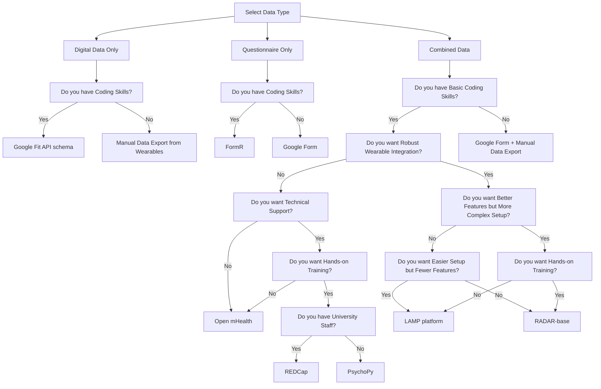

```mermaid
graph TD
    A[Select Data Type] --> B1[Digital Data Only]
    A --> B2[Questionnaire Only]
    A --> B3[Combined Data]

    B1 --> C1[Do you have Coding Skills?]
    C1 -- Yes --> D1[Google Fit API schema]
    C1 -- No --> D2[Manual Data Export from Wearables]

    B2 --> C2[Do you have Coding Skills?]
    C2 -- Yes --> D3[FormR]
    C2 -- No --> D4[Google Form]

    B3 --> C3[Do you have Basic Coding Skills?]
    C3 -- Yes --> C4[Do you want Robust Wearable Integration?]
    C3 -- No --> D5[Google Form + Manual Data Export]
    

    C4 -- No --> C5[Do you want Technical Support?]
    C5 -- No --> D6[Open mHealth]
    C5 -- Yes --> C6[Do you want Hands-on Training?]
    C6 -- Yes --> C7[Do you have University Staff?]
    C7 -- Yes --> D7[REDCap]
    C7 -- No --> D8[PsychoPy]
    C6 -- No --> D6[Open mHealth]

    C4 -- Yes --> C8[Do you want Better Features but More Complex Setup?]
    C8 -- No --> C9[Do you want Easier Setup but Fewer Features?]
    C9 -- Yes --> D9[LAMP platform]
    C9 -- No --> D10[RADAR-base]
    C8 -- Yes --> C10[Do you want Hands-on Training?]
    C10 -- Yes --> D10[RADAR-base]
    C10 -- No --> D9[LAMP platform]
```